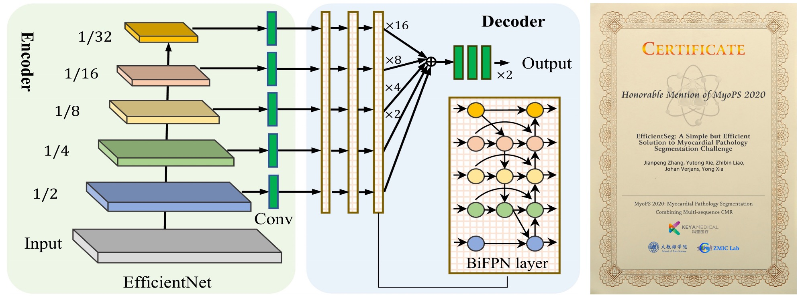

# EfficientSeg
<p align="left">
    
</p>


This repo holds the pytorch implementation of our [MyoPS 2020 Challenge](https://zmiclab.github.io/projects/myops20/index.html) solution - EfficientSeg (Honorable Mention of MyoPS 2020):<br />

**EfficientSeg: A Simple But Efficient Solution to Myocardial Pathology Segmentation Challenge** 
(https://link.springer.com/content/pdf/10.1007%2F978-3-030-65651-5_2.pdf)


## Model Training
```
sh train.sh
```
## Evaluation
```
python evaluate.py
```

## Post-processing
```
python post-processing.py
```

### 6. Citation
If this code is helpful for your study, please cite:
```
@inproceedings{zhang2020efficientseg,
  title={EfficientSeg: A Simple But Efficient Solution to Myocardial Pathology Segmentation Challenge},
  author={Zhang, Jianpeng and Xie, Yutong and Liao, Zhibin and Verjans, Johan and Xia, Yong},
  booktitle={Myocardial Pathology Segmentation Combining Multi-Sequence CMR Challenge},
  pages={17--25},
  year={2020},
  organization={Springer}
}
```


### Contact
Jianpeng Zhang (james.zhang@mail.nwpu.edu.cn)
